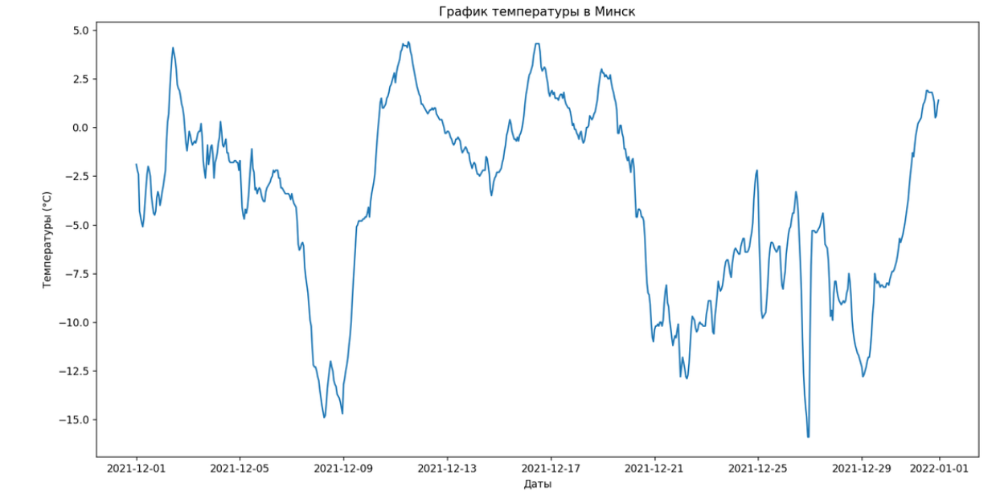

# grafic_temperatire

## Оглавление

* [Описание проекта](#описание-проекта)
    * [Основные возможности](#основные-возможности)
    * [Предварительные требования](#предварительные-требования)
    * [Установите зависимости](#установите-зависимости)
* [Запуск и использование](#Запуск-и-использование)
    * [Запуск программы](#запуск-программы)
    * [Обязательные аргументы](#обязательные-аргументы)
* [Пример вывода](#Пример-вывода)
* [Цель проекта](#цель-проекта)

## Описание проекта

Данный скрипт позволяет получать диаграмму погоды в определённые даты в определённом городе.

Программа использует сайты:

- [opendatasoft](https://data.opendatasoft.com/)
- [archive-api.open-meteo](https://open-meteo.com/)

### Основные возможности

1. Получает кординаты города с сайта [opendatasoft](https://data.opendatasoft.com/)
2. Получает данные о погоде в промежутки времени с сайта [archive-api.open-meteo](https://open-meteo.com/)
3. С помощью библиотек `matplotlib` и `pandas` выводит данные в формате диаграммы. 

#### *Уточнение:* 

Формат и представление диаграммы можно менять в зависимости от цели. 

Подробности в [документации к библиотеке matplotlib](https://thecode.media/biblioteka-matplotlib/) или [докуметации из уроку](https://docs.yandex.ru/docs/view?url=ya-disk-public%3A%2F%2FTaKvR7EYwUBS89cFLnll3pD5xH3cV3iNpRcce6mrwwIXoaB2XBHC4Q3amvqNFvoPq%2FJ6bpmRyOJonT3VoXnDag%3D%3D&name=15.%20Библиотека%20Matplotlib%20для%20визуализации%20данных.docx&nosw=1), по которому был создан проект. 

Информацию по библиотеке можно найти и в других интернет источниках.

### Предварительные требования:

1. Установленный [Python](https://www.python.org/downloads/) версии 3.11 и выше.
2. pip - установщик пакетов Python.
3. Подключение к Интернету (для захода на сайт).

### Установите зависимости

С активированным виртуальным окружением установите зависимости проекта:

```bash
pip install -r requirements.txt
```

## Запуск и использование

### Запуск программы

```
python main.py название-города начало-диапозона конец-диапозона код-города
```

По итогу у вас откроется вкладка с диаграммой погоды по выбранному вам диапозону дат и городу.

### Обязательные аргументы

```
python main.py название-города начало-диапозона конец-диапозона код-города
```

Обязательные аргемменты программы:

    - city_name STR - название города, например Sookalda
    - start_date DATE - начальная дата прогноза
    - end_date DATE - конечная дата прогноза
    - сountry_code STR - Код города, например EE

## Пример вывода



## Цель проекта

Код написан в образовательных целях на онлайн-курсе для веб-разработчиков [dvmn.org](https://dvmn.org/).